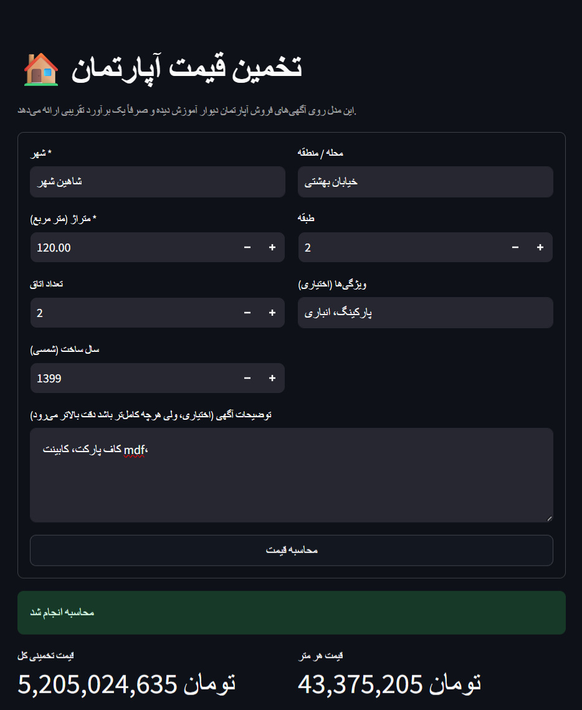

# House Price Prediction

A machine learning project for predicting residential apartment prices using real-world property listings from Divar.

The project covers the complete machine learning workflow, from data cleaning and exploratory analysis to feature engineering, text processing, model training, evaluation, and an interactive prediction interface.

## Overview

The goal of this project is to estimate the total selling price of apartments based on structured and unstructured information available in property listings.

The model uses features such as:

- Area
- Number of rooms
- Floor
- Building age
- Location
- Property amenities
- Listing title
- Listing description

The project uses **LightGBM** as the main prediction model, with **CatBoost** also explored during the experimentation process.

## Dataset

The dataset consists of approximately **24,500 property listings with 49 features**, collected from Divar.

The original data contains information about:

- Property characteristics
- Location
- Amenities
- Listing title and description
- Property price

During preprocessing, the dataset was filtered and cleaned to focus on **apartments listed for sale**.

The final preprocessing pipeline includes filtering invalid listings, handling missing values, removing outliers, and transforming relevant Persian and numerical fields.

## Machine Learning Pipeline

The project follows these main steps:

1. Data cleaning and preprocessing
2. Exploratory Data Analysis (EDA)
3. Feature engineering
4. Extraction of property amenities from listing text
5. Location-based feature engineering
6. TF-IDF text feature extraction
7. Target encoding for categorical location features
8. Outlier detection and removal
9. Log transformation of the target variable
10. Train/validation/test split
11. Model training
12. Model evaluation

### Feature Engineering

Several additional features were extracted from the raw listing data.

Examples include binary indicators for:

- Parking
- Elevator
- Storage
- Yard
- Balcony
- CCTV
- Double-glazed windows

Location information was also processed to create combined location features such as `city_district`.

### Text Features

Listing titles and descriptions contain useful information that is not captured by the numerical features alone.

TF-IDF was therefore used to extract textual features from the listing text, including unigram and bigram representations.

To avoid data leakage, the TF-IDF vectorizers in the final training pipeline are fitted **only on the training data** and then applied to validation/test data.

## Model

### LightGBM

The main model is LightGBM configured as a regression model with an L1 objective.

The final configuration includes:

```text
objective      = regression_l1
n_estimators   = 1000
learning_rate  = 0.01
num_leaves     = 40
random_state   = 42
```

Early stopping is used based on validation performance.

### CatBoost

CatBoost was also experimented with as an alternative gradient boosting approach and compared with LightGBM during the modeling process.

## Evaluation

The models are evaluated using standard regression metrics:

- RMSE
- R²
- MAPE

Final values should be reported from the latest validated test-set results.

| Model    | RMSE |   R² | MAPE |
| -------- | ---: | ---: | ---: |
| LightGBM | 0.24 | 0.82 | 0.14 |
| CatBoost | 0.38 | 0.71 | 0.27 |

> The reported metrics should be calculated on the untouched test set and should not use filtered or custom versions of MAPE as the primary evaluation metric.

## Results

The project includes visual analysis of model performance, including actual-vs-predicted price comparisons and feature importance analysis.

The target variable is modeled using a logarithmic transformation to reduce the effect of highly expensive properties and improve model stability.

Predictions are converted back to the original price scale using the inverse transformation.

## Demo

The project includes an interactive prediction interface built with **Streamlit**.

Users can enter property information and receive an estimated apartment price through the trained model.



## Project Structure

```text
house-price-prediction/
│
├── app/
│   └── app.py
│
├── models/
│   └── ...
│
├── notebooks/
│   └── house_price_prediction.ipynb
│
├── data/
│   └── ...
│
├── requirements.txt
├── README.md
├── screen.png
└── .gitignore
```

The notebook contains the main data analysis, experimentation, feature engineering, model training, and evaluation workflow.

The Streamlit application provides a lightweight interface for using the trained model.

## Installation

Clone the repository and install the required dependencies:

```bash
git clone <repository-url>
cd house-price-prediction

pip install -r requirements.txt
```

## Running the Application

Start the Streamlit application with:

```bash
streamlit run app/app.py
```

The application will open in your browser and allow you to enter property information and generate a price prediction.

## Technologies

- Python
- Pandas
- NumPy
- Scikit-learn
- LightGBM
- CatBoost
- Matplotlib
- Seaborn
- Streamlit
- Jupyter Notebook

## Key Machine Learning Concepts

This project demonstrates practical experience with:

- Exploratory Data Analysis
- Data Cleaning
- Feature Engineering
- Regression
- Gradient Boosting
- LightGBM
- CatBoost
- TF-IDF
- Target Encoding
- Outlier Detection
- Log Transformation
- Model Evaluation
- Model Interpretation
- Basic ML Deployment

## Future Improvements

Potential improvements include:

- Expanding the dataset with additional listings
- Improving location feature representation
- Hyperparameter optimization
- Better handling of unseen locations
- Experimenting with more advanced text representations
- Deploying the prediction interface online
